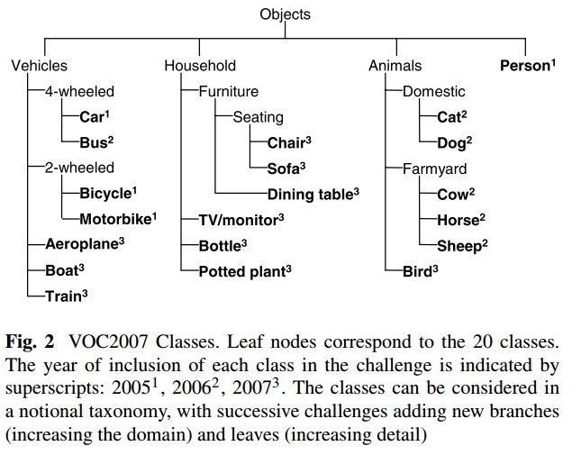

## 行人检测项目文档

一、项目概览
---

机器视觉要解决的中心问题就是如何从图像中解析出计算机可以理解的信息。计算机对于图像的理解主要有三个层次：分类、检测和分割。目标检测处于图像理解的中层次。

图像分类关心的是整体，给出的是整张图片的内容描述，而目标检测则关注特定的物体目标，要求同时获得这一目标的类别信息和位置信息。目标检测是对图片前景和背景的理解，我们需要从背景中分离出目标，并确定这一目标的类别和位置。

用于目标检测的模型结构有很多，在本文中对这些算法做一些简要介绍。

二、目标检测算法综述
---
目标检测可以理解为是物体识别和物体定位的综合，不仅仅要识别出物体属于哪个分类，更重要的是得到物体在图片中的具体位置。

目标检测模型分为两类。一类是two-stage，将物体识别和物体定位分为两个步骤，分别完成，这一类的典型代表是`R-CNN`, `fast R-CNN`, `faster R-CNN`。他们识别错误率低，漏识别率也较低，但速度较慢，不能满足实时检测场景。为了解决这一问题，另一类方式出现了，称为one-stage, 典型代表是`Yolo`, `SSD`, `YoloV2`等。他们识别速度很快，可以达到实时性要求，而且准确率也基本能达到faster R-CNN的水平。下面针对这几种模型进行详细的分析。

### 1、R-CNN
2014年[R-CNN](https://github.com/rbgirshick/rcnn)算法被提出，基本奠定了two-stage方式在目标检测领域的应用。该算法将CNN方法引入目标检测领域，大大提高了目标检测效果，其网络结构如下：

RCNN的算法分为4个步骤：
- 候选区域生成： 采用Selective Search 方法一张图像生成1K~2K个候选区域
- 特征提取：使用深度卷积网络CNN对每一个候选区域提取特征
- 类别判断：将特征送入每一类的SVM分类器，判断是否属于该类
- 位置精修：使用回归器精细修正候选框位置

对比传统的目标检测算法，RCNN获得了50%的性能提升，在使用VGG-16模型作为物体识别模型情况下，在`voc2007`数据集上可以取得66%的准确率。但因为使用Selective Search方法选择候选框以及对所有2k次左右的卷积网络计算而产生速度慢、内存占用量大的问题。

### 2、Fast R-CNN
2015年Ross Girshick提出了[Fast R-CNN](https://github.com/rbgirshick/fast-rcnn)算法，同样使用最大规模的网络，Fast R-CNN和R-CNN相比，训练时间从84小时减少为9.5小时，测试时间从47秒减少为0.32秒。在`PASCAL VOC 2007`数据集上的准确率相差无几，约在66%-67%之间。其网络结构如下：


该算法解决了R-CNN算法的三个问题：
- 通过将整张图像归一化后直接送入深度网络。在邻接时，才加入候选框信息，在末尾的少数几层处理每个候选框来解决`测试时速度慢`的问题
- 通过先将一张图像送入网络，紧接着送入从这幅图像上提取出的候选区域来解决`训练时速度慢`的问题。这些候选区域的前几层特征不需要再重复计算。
- 通过把类别判断和位置精调统一用深度网络实现来解决`训练所需空间大`的问题，不再需要额外存储。

### 3、Faster R-CNN
Ross B. Girshick在2016年提出了新的[Faster RCNN](https://github.com/rbgirshick/py-faster-rcnn)，在结构上，Faster RCNN已经将特征抽取(feature extraction)，proposal提取，bounding box regression(rect refine)，classification都整合在了一个网络中，使得综合性能有较大提高，在检测速度方面尤为明显。

R-CNN和fast R-CNN均由选择性搜索来生成候选框，导致检测速度较慢。faster R-CNN 针对这个问题，提出了RPN网络来进行候选框的获取，从而摆脱了选择性搜索算法，也只需要一次卷积层操作，从而大大提高了识别速度。

faster R-CNN主要有４个步骤：
- 卷积层。原始图片先经过conv-relu-pooling的多层卷积神经网络，提取出特征图。供后续的RPN网络和全连接层使用。
- RPN层，region proposal networks。RPN层用于生成候选框，并利用softmax判断候选框是前景还是背景，从中选取前景候选框（因为物体一般在前景中），并利用bounding box regression调整候选框的位置，从而得到特征子图，称为proposals。
- ROI层，fast R-CNN中已经讲过了ROI层了，它将大小尺寸不同的proposal池化成相同的大小，然后送入后续的全连接层进行物体分类和位置调整回归
- 分类层。利用ROI层输出的特征图proposal，判断proposal的类别，同时再次对bounding box进行regression从而得到精确的形状和位置。

使用`VGG-16`卷积模型的faster R-CNN网络结构如下所示：


### 4、Yolo：you only look once
[Yolo](https://pjreddie.com/darknet/yolo/)将物体检测作为回归问题求解。基于一个单独的end-to-end网络，完成从原始图像的输入到物体位置和类别的输出。Yolo直接在输出层回归bounding box的位置和bounding box所属类别，从而实现one-stage。通过这种方式，yolo可实现45帧每秒的运算速度，完全能满足实时性要求（达到24帧每秒，人眼就认为是连续的）。Yolo的网络结构如下所示：

Yolo主要分为三个部分：
- 卷积层：采用`Google inceptionV1`网络，共20层。这一层主要是进行特征提取，从而提高模型泛化能力。
- 目标检测层：先经过4个卷积层和2个全连接层，最后生成7x7x30的输出。先经过卷积层的目的是为了提高模型泛化能力。yolo将一副448x448的原图分割成了7x7个网格，每个网格要预测两个bounding box的坐标(x,y,w,h)和box内包含物体的置信度confidence，以及物体属于20类别中每一类的概率（yolo的训练数据为voc2012，它是一个20分类的数据集）。所以一个网格对应的参数为（4x2+2+20) = 30。
- NMS筛选层：在多个bounding box中筛选出最合适的几个，先过滤掉score低于阈值的box，对剩下的box进行NMS非极大值抑制，去除掉重叠度比较高的box。

Yolo将物体分类和物体检测网络合二为一，都在全连接层完成。故它大大降低了目标检测的耗时，提高了实时性。它主要有以下缺点：
- 每个网格只对应两个bounding box，当物体的长宽比不常见，效果很差。
- 两个物体很近时，效果很差。
- 容易出现漏检。
- 对于图片中较小的物体，效果很差。

### 5、SSD：Single Shot MultiBox Detector
> [Wei Liu, Dragomir Anguelov, et al. "SSD：Single Shot MultiBox Detector" 	ECCV 2016, 1512.02325 [cs.CV] ](https://arxiv.org/abs/1512.02325)

Faster R-CNN准确率mAP较高，漏检率recall较低，但速度较慢。而yolo则相反，速度快，但准确率和漏检率不尽人意。[SSD](https://github.com/balancap/SSD-Tensorflow)综合了他们的优缺点，对输入300x300的图像，在voc2007数据集上test，能够达到58 帧每秒( Titan X 的 GPU )，72.1%的mAP。其网络结构如下：


SSD和Yolo一样，也分为如下三部分：
- 卷积层：采用了`VGG16`的基础网络，先用一个CNN网络来提取特征，然后再进行后续的目标定位和目标分类识别。
- 目标检测层：这一层由5个卷积层和一个平均池化层组成。去掉了最后的全连接层。SSD认为目标检测中的物体，只与周围信息相关，它的感受不是全局的，所以没有做全连接。
- NMS筛选层：和yolo的筛选层基本一致，先过滤掉概率低于阈值的default box，再采用NMS非极大值抑制，筛掉重叠度较高的。只不过SSD综合了各个不同feature map上的目标检测输出的default box。

SSD的特点如下：
- 在多尺寸的feature map上进行目标检测，大大提高了泛化能力，这是其相比于yolo提高准确率的关键所在
- 多个anchors，每个anchor对应4个位置参数和21个类别参数，这个策略提高了4%的准确率
- 采用了数据增强，生成与目标物体真实box间IOU为0.1 0.3 0.5 0.7 0.9的patch，随机选取这些patch参与训练，并对他们进行随机水平翻转等操作。这个策略提高了8.8%的准确率。

SSD基本已经可以满足在手机端上实时物体检测需求了，TensorFlow在Android上的目标检测官方模型[ssd_mobilenet_v1_android_export.pb](https://github.com/tensorflow/tensorflow/tree/master/tensorflow/examples/android)，就是通过SSD算法实现的。它的基础卷积网络采用的是`mobileNet`，适合在终端上部署和运行。


三、项目配置
---

### 1、开发环境
- Python3.6.6
- TensorFlow 1.14
- Cython0.29.14
- Visual Studio 15 生成工具 2017（
VC++ 2017 version 15.9 v14.16 latest v141 tools）
- Windows 10 SDK (10.0.17763.0)
- Windows 8.1 SDK 和 UCRT SDK

### 2、C/C++文件编译
项目中使用`Cython`编写了基于CPU/GPU进行类内`NMS`抑制大量相同的预测框的算法，需要使用Cython将`.pyx`文件编译为`.pyd`文件以及可以调用Python源码的C/C++代码，生成动态链接库（相关文件已经生成，在此仅作方法介绍）。
```sh
cd utils/nms
# 根据要编译的文件修改代码中的文件名
python setup.py
```
注：使用python3.7.x会报错，请使用低版本python

四、项目介绍及原理
---
### 1、参考文献
> [Songtao Liu, Di Huang, Yunhong Wang, "Receptive Field Block Net for Accurate and Fast Object Detection" Accepted by ECCV 2018, 1711.07767 [cs.CV]](https://arxiv.org/abs/1711.07767)

### 2、深度学习网络模型
基于区域(Region-baesd)的卷积神经网络（R-CNN）及其衍生网络(如Fast R-CNN和Faster R-CN等)在Pascal VOC，MS COCO和ILSVRC等主要的比赛和基准测试中不断提升着目标检测的最高性能，但是，因为使用更深层的神经网络，其计算成本不断增加、检测速率不断降低。

Yolo和SSD等one-stage模型做到了目标的实时检测，但是模型精度却不如two-stage模型。根据Songtao Liu等人的论文，他们提出的RFB-Net可以在兼顾速度的同时达到良好的效果。

该网络主要在SSD网络中引入Receptive Field Block (RFB) ，引入RFB的出发点通过模拟人类视觉的感受野加强网络的特征提取能力，在结构上RFB借鉴了Inception的思想，主要是在Inception的基础上加入了dilated卷积层（dilated convolution），从而有效增大了感受野（receptive field）。整体上因为是基于SSD网络进行改进，所以检测速度还是比较快，同时精度也有一定的保证。

人类视觉系统中的RF结构：


受人类视觉系统中RF结构的启发，作者引入了`感受野模块（RFB）`，加强了从轻量级CNN模型中学到的深层特征，使检测模型更加快速且准确。如下图的RFB模块示意图，RFB利用具有与不同尺寸的RF相对应的不同卷积核的多分支池，应用膨胀卷积层来控制它们的偏心率，并将它们重新整合以生成最终表示。作者将RFB模块组装在SSD 上, 构建了一个新的one-stage检测模型（RFB Net）。得益于这样一个简单的模块，RFB Net展现出了相当不错的结果: 在精度可以与最新的基于更深层神经网络的检测模型相媲美的同时, 保持了原始轻量级检测模型的高速度。此外，由于对网络架构施加的限制很少, RFB可以作为一种通用模块嵌入到绝大多数网路当中。


作者将该模型于一些state of the art模型在VOC2007测试集上进行了对比，发现即使是原始的RFB-Net（RFB-Net300）也有着优于SSD和Yolo的实验结果（mAP未80.5%），与此同时也保持了SSD300的实时速度。而且，RFB-Net甚至可以达到于最新的two-stage检测模型（R-FCN）相同的精度。

RFB Net512是在放大了输入尺寸的情况下的实验结果,最终实现了82.2％的mAP，优于大多数one-stage和two-stage检测模型.虽然它拥有较深的backbone, 但仍然保持着很高的速度。

本项目依照作者提供的代码进行实验、修改。

### 3、数据集来源
本项目使用[CUHK Occlusion Dataset](http://mmlab.%3C/b%3Eie.cuhk.edu.hk/datasets/cuhk_occlusion/index.html) 

该数据集出自香港中文大学，可以用于行为分析和行人检测。`labels.zip`压缩包内为每一个`.seq`视频文件对应的行人标注信息`.vbb`文件。

### 4、PASCAL VOC格式数据集介绍
`PASCAL`的全称是Pattern Analysis, Statistical Modelling and Computational Learning, 是一个由欧盟资助的网络组织。

`VOC`的全称是Visual Object Classes。

`PASCAL VOC挑战赛`（The PASCAL Visual Object Classes）是一个世界级的计算机视觉挑战赛。

下图所示是PASCAL VOC数据集中的20个类别的层级结构：


### 5、数据集处理
`CUHK Occlusion Dataset`提供的行人数据是`.seq`和`.vbb`文件格式。`.seq`文件存储的是摄像头拍摄的视频，`.vbb`文件则保存了针对视频中每一帧图像的行人标注数据。

为了使用数据集，我们需要先对数据集进行处理，提取相关的信息制作符合要求的数据集。

#### 5.1、从视频中提取每一帧图像
我们使用`cv2`从`.seq`文件中提取视频中的每一帧图像(`seq2png.py`)：
```sh
import os
import glob
import cv2 as cv
 
# 保存图片以指定名字到指定位置
def save_img(fn, i, frame):
    cv.imwrite('{}_{}_{}.png'.format(
        out_dir, os.path.basename(fn).split('.')[0], i), frame)
    
    
#输出图片位置，选择自己的图片保存位置    
out_dir=r''
if not os.path.exists(out_dir):
    os.makedirs(out_dir)

#seq文件位置
for fn in sorted(glob.glob('C:/Users/Desktop/dataset/*.seq')):
    cap = cv.VideoCapture(fn)
    i = 0
    while True:
        # ret为标志位，bool型，是否读到数据，frame为视频帧图像数据
        ret, frame = cap.read()
        if not ret:
            break
        save_img(fn, i, frame)
        i += 1
    print(fn)
```

#### 5.2、提取图片中行人标记信息
CUHK提供的数据集对视频中的行人均已经进行了标记，`.vbb`文件可以用Matlab直接打开查看其中记录的详细内容。在本项目中，我们使用`scipy`模块的`loadmat`函数对其进行处理。一个`.vbb`文件对应一个`.seq`文件，即一个`.vbb`文件记录的是一段视频每一帧图像的标注信息。

在`CUHK Occlusion Dataset`中，对图像上的行人的标注分为了`people`和`person`两类，在本项目中，我们选用所有的`person`类别的标注信息。

对于提取出来的每一张图像，我们需要将图像中的每一个标记的位置信息以及类别记录到对应的`.txt`文件中（文本文件与图像同名）。因为我们只使用`person`类别，所以对于每一个标记，我们都将其类别记为`0`。对于标记的位置，我们记录的是标记框的左上角和右下角两个位置的四个坐标分别占图片宽和高的比例。`.txt`文件中记录的数据格式如下：
```sh
0 0.22792308151283744 0.4198669732424787 0.2620299051021194 0.45966652593486135
0 1.0766158041423244 0.29900876649348807 0.0365365094570194 0.07829863442031151
```
第一个数字表示该标识所属类别，后面四个数字分别表示标识框左上角坐标和右下角坐标的x、y值占图片宽和高的比例。


具体实现如下(`vbb2txt.py`)：

```sh
import os, glob
import cv2
from scipy.io import loadmat
import numpy as np

# 根据自己的情况修改文件夹位置
vbb_dir=r'C:\Users\Desktop\dataset\labels'
images_dir = r'C:\Users\Desktop\dataset\images'

# 将标注信息进行转换
def convert(size, box):
    dw = 1./size[0]
    dh = 1./size[1]
    x = box[0] + box[2]/2.0
    y = box[1] + box[3]/2.0
    w = box[2]
    h = box[3]
    x = x*dw
    w = w*dw
    y = y*dh
    h = h*dh
    return (x,y,w,h)

def visualizeBox(im, box, imname):
    # 在图像上画出圈定的方框
    # 传入的参数是左上角x和y坐标，宽和高
    cv2.rectangle(im, (int(box[0]), int(box[1])), (int(box[0]+box[2]), int(box[1]+box[3])), (0,0,255), 2)
    cv2.imwrite(imname,im)

for f in sorted(glob.glob('C:/Users/Desktop/dataset/labels/*.vbb')):
    vbb = loadmat(f)
    # 每一帧的object信息：id，pos，posv，occlusion，lock
    objLists = vbb['A'][0][0][1][0]
    # 所有类别
    objLbl = [str(v[0]) for v in vbb['A'][0][0][4][0]]
    if 'person' in objLbl:
        person_index_list=np.where(np.array(objLbl)=="person")[0]
    elif 'object' in objLbl:
        person_index_list=np.where(np.array(objLbl)=="object")[0]
    i = 0 
    for frame_id, obj in enumerate(objLists):
        if len(obj) > 0:
            frame_name = "images_" + os.path.basename(f).split('.')[0] +"_" +str(i)+".png"
            boxes = []
            for Id, pos, occl in zip(obj['id'][0], obj['pos'][0], obj['occl'][0]):
                # matlab从1开始
                Id = int(Id[0][0]) - 1
                if not Id in person_index_list:
                    continue
                pos = pos[0].tolist()
                boxes.append(pos)
            if boxes:
                # 针对每一张图像记录其标注信息。
                full_path ="C:/Users/Desktop/dataset/txts/%s"%("images_" + os.path.basename(f).split('.')[0] +"_" +str(i)+".txt")
                txt_file = open(full_path, 'a')
                im = cv2.imread(os.path.join(images_dir, frame_name))
                imsize = im.shape
                for box in boxes:
                    convert_size = convert(imsize, box)
                    txt_file.write('0' + ' ' + str(convert_size[0]) + ' ' + str(convert_size[1]) + ' ' + str(convert_size[2]) + ' ' +str(convert_size[3]))
                    txt_file.write('\n')
                    visualizeBox(im, box, frame_name)
        i += 1
    print(f)
```


#### 5.3、提取训练集
除了上述的画有标识框的图片以及每张图片对应的标识框信息文本文件之外，我们还需要一份`.txt`文件记录用来训练的每一张图片的文件名。

处理方法如下：
```sh
import os, glob

# 根据自己文件夹的位置修改文件夹路径
txt_path = "C:/Users/Desktop/dataset/train.txt"
txt_file = open(txt_path,'a')
for f in sorted(glob.glob('C:/Users/Desktop/dataset/images/*.png')):
    full_name = os.path.basename(f)
    file_name = full_name.split("/")[-1]
    txt_file.write(file_name + '\n')

```
得到`train.txt`

#### 5.4、处理之后的图片展示


### 五、项目结果展示
使用如下命令查看视频演示结果
```sh
cd Pedestrian-detection
python demo.py
```
